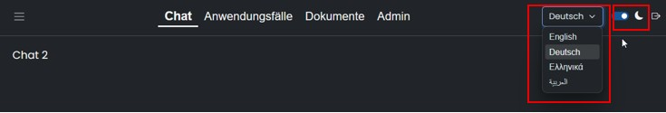
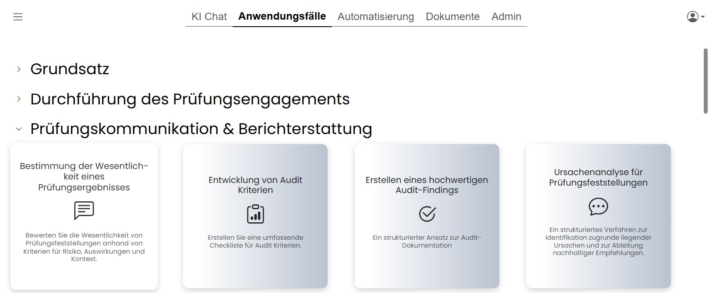
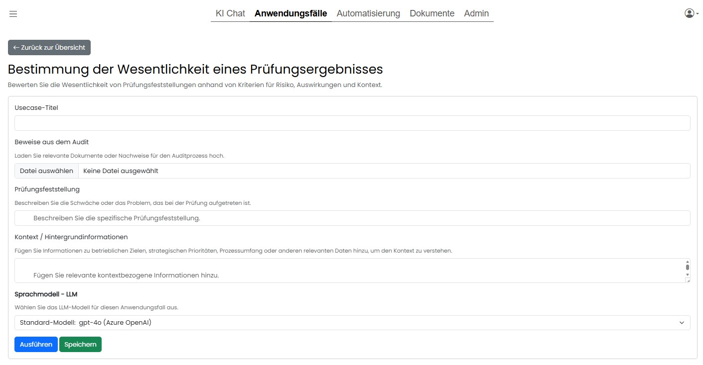
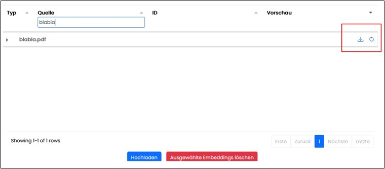
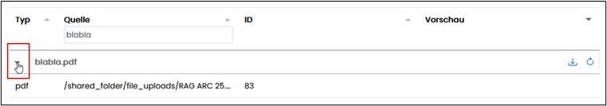

# ARC Assist Anwenderhandbuch

| Version | Autor | Datum     |
| ------- | ----- | --------- |
| 2.0     | CGS   | 02.02.2026|

### Inhaltsverzeichnis
- Anwendungsbeschreibung(#anwendungsbeschreibung)
- Assist Anwendung(#assist-Anwendung)
- Navigationsbereich "KI Chat"(#navigationsbereich-KI-Chat)
- Navigationsbereich "Anwendungsfälle"(#navigationsbereichn-Anwendungsfälle)
- Navigationsbereich "Automatisierung"(#navigationsbereich-Automatisierung)
- Navigationsbereich "Dokumente"(#navigationsbereich-Dokumente)

## 1. Anwendungsbeschreibung(#anwendungsbeschreibung)

Es ist innerhalb von ARC Assist, im weiteren nur noch Assist genannt, möglich, KI-unterstütztes Unternehmenswissen in separaten Chats oder vorbereiteten Anwendungsfällen abzufragen und zu nutzen. 
Dieses Wissen basiert auf den Inhalten der hinterlegten Dokumente.
Alle Chatverläufe und Use Case Verläufe werden gespeichert und können auch nach dem Browser schließen und Neuanmeldung wieder geöffnet werden.
Bestimmte regelmäßige Anwendungsfälle werden im Assist als Templates verwaltet, um Routinen zu vereinfachen. Die Anwendungsfälle sind mit Use Cases wie eine Art Checkliste erstellt.

Über eine Navigation am oberen Rand sind die thematisierten Navigationsbereiche erreichbar.

Unterseiten dieser Navigationsbereiche sind dann jeweils über die Baumnavigation am linken Rand erreichbar.

Zusätzlich kann eine Auswahl der Sprache innerhalb der Anwendung getroffen werden und die Ansicht in den Dark Mode, bzw. wieder zurück, gewechselt werden.

### 1.1 Assist Anwendung(#assist-Anwendung)

#### 1.1.1 Navigationsbereich "KI Chat"(#navigationsbereich-KI-Chat)

#### 1.1.2 Navigationsbereich "Anwendungsfälle"

Hier werden alle aktivierten Anwendungsfälle, nach den Bereichen gruppiert, angezeigt.
Anwendungsfälle sind in der Administration hinterlegte und freigegebene Use Case Listen,
die vor der Ausführung nur noch mit konkreten Inhalten zu befüllen sind. Diese Listen erleichtern routinemäßige Anfragen.

Zum Öffnen eines konkreten Anwendungsfalles wird auf das Symbol mit Namen geklickt.

Klick auf ein Symbol mit Namen öffnet den Anwendungsfall zur Datenaufnahme.

Hier werden bereits fertig hinterlegte Use Cases angezeigt, die mit Eingaben befüllt werden können. Anschließend kann die Abfrage durch Klick auf „Ausführen“ gesendet werden.
Während der Verarbeitung wird eine Wait Box angezeigt und der Statusverlauf als Info angezeigt.

Nach der Rückmeldung zur Anfrage kann über einen Butten in den Navigationsbereich „Chat“ geöffnet werden, um auf diesen konkreten Use Case weitere Anfragen zu starten.
Das Ergebnis einer Anfrage kann auch gespeichert werden und ist dann als separater Chat verfügbar.
Um einen Use Case zu löschen, muss zuerst der Lösch Button betätigt werden und danach die Abfrage mit „OK“ bestätigt werden.

#### 1.1.3 Navigationsbereich "Automatisierung"(#navigationsbereich-Automatisierung)

Hier werden bei vorhandener Berechtigung, alle automatisierten Anwendungsfälle gelistet und verwaltet.
Die markierte Nummer (rot) zeigt die Anzahl der aktuellen Ergebnisse das letzten Laufs.

Zum Öffnen der Zeitpläne wird auf das Symbol mit Namen geklickt.
In der Übersicht werden alle gespeicherten Zeitpläne angezeigt, es können Neue ertsellt werden und vorhandene gelöscht werden.

Im Bereich Ausführungsprotokolle werden alle Programmläufe gelistet. Über einen Button können die genauen Details angesehen werden oder die Lesebestätigung gesetzt werden.
Habe es auch gelesen ?????

#### 1.1.4 Navigationsbereich "Dokumente"(#navigationsbereich-Dokumente)

Hier werden alle verfügbaren und durchsuchbaren Dokumente angezeigt, für die der Anwender mit seiner Rolle berechtigt ist.
Die Dokumente können über einen Button heruntergeladen werden und manuell die Ansicht aktualisiert werden. Über das Reload Icon werden die einzelnen Embeddings, also Teildokumente, nachgeladen. 
Bei vielen Dokumenten kann es dabei zu Zeitverzögerungen kommt und deshalb wurde ein Lazy-Loading hier implementiert.
Im oberen Bereich befinden sich Filter- um die Anzahl zu begrenzen und Sortierungsmöglichkeiten nach Quelle, ID und Vorschau.
Die Filterresultate aktualisieren sich bereits während der Eingabe.
Über das Upload Icon können Teildokumente geöffnet und gleichzeitig heruntergeladen werden.

Über einen Klick auf das Symbol vor dem Dokument können die Teildokumente angezeigt werden.

Durch Klick auf ein Dokument in der Spalte „Vorschau“ rechts, wird diese markiert und kann dann z.B. gelöscht werden.

